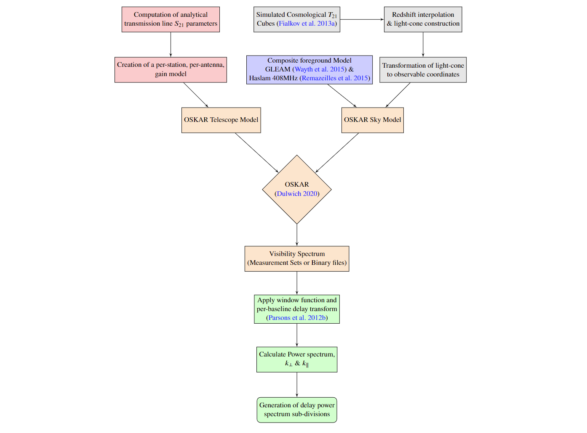

# SKA_Power_Spectrum_and_EoR_Window

The Aperture Array Verification System 2, is an engineering platform array for the Square Kilometer Array (SKA), 
featuring 7m coaxial transmission lines connecting the low noise amplifier of the SKALA4.1 antenna to the SMART box. An 
impedance mismatch between these components results in a partially reflected electromagnetic signal, which introduces 
chromatic aberrations in the instrument bandpass, and propagates the foreground power to higher delays, potentially 
contaminating the Epoch of Reionisation (EoR) window. This paper presents the first end-to-end simulation pipeline for 
SKA-LOW based on the Oxford Square Kilometre Array Simulator using a composite sky model that combines radio foregrounds
from The Galactic and Extragalactic All-Sky MWA Survey, Haslam $408$ MHz, and a simulated 1.5Gpc 21-cm brightness 
temperature cube generated via a semi-numerical code. We implement a parametric approach to account for the effects of 
the coaxial transmission line and derive an analytical model that expresses the scattering parameters in terms of the 
bulk material parameters and is consistent with numerical simulation to 5%. The delay power spectrum is subdivided into 
three distinct regions, The EoR Window, The Calibration Window, and The Foreground Wedge, to quantify potentially 
contaminated k-modes in a statistically significant manner. We demonstrate that for a 125kHz channel width, a coaxial 
transmission line of length $\leq 20.64$ m with an impedance mismatch $\leq 20\Omega$ will not prevent a successful 
detection of the 21cm signal within the EoR Window. However, we demonstrate experiments that implement foreground 
removal must be trained with prior knowledge of the cable specifications, tolerances and thermal variation.



Project Environment & Dependencies 
----------------------------------
To run the Square Kilometer Array End-2-End Pipeline for Power Spectrum & EoR analysis the following steps may be taken
to install the required dependencies, on an HPC service.
1. ``module load singularity``
2. ``singularity build --sandbox oskar_pipeline docker://oscarohara/oskar_pipeline``


High Performance Computing Services
-------
To run the Square Kilometer Array End-2-End Pipeline for Power Spectrum & EoR analysis the following steps may be taken to install the required dependencies, on the HPC. 

1. ``module load singularity``
2. ``singularity build --sandbox test docker://oscarohara/oskar_pipeline:v1.2``
3. Download the following data and locate in the relevant locations according to the 'Project File Tree':
    - The de-sourced GLEAM catalogue (``GLEAM_EGC_v2.fits``) may be obtained on Vizer [here](http://cdsarc.u-strasbg.fr/viz-bin/Cat?VIII/100#/browse), and should be located at ``sky_map/`` before being unzipped using ``gzip -d GLEAM_EGC_v2.fits.gz``
4. Modify the slurm submission script, an example of which may be found [here](https://github.com/oharao/SKA_Power_Spectrum_and_EoR_Window/blob/main/Documentation/slurm_ska_pipeline_example.txt)


Project File Tree
------------------

```
SKA_Power_Spectrum_and_EoR_Window
├── Cable Decay .ipynb
├── Dockerfile
├── Documentation
│   └── images
│       ├── coax_structure.png
│       └── project_layout.png
├── sky_map
│   ├── GLEAM_EGC_v2.py
│   ├── read_gleam.py
│   └── gsm_gleam.py
├── End2End
│   ├── Coaxial_Transmission.py
│   ├── OSKAR_default_script.py
│   ├── __pycache__
│   │   └── generate_EoR.cpython-38.pyc
│   ├── antenna_pos
│   │   ├── layout_wgs84.txt
│   │   ├── position.txt
│   │   ├── station000
│   │   │   └── layout.txt
│   │   ├── station001
│   │   │   └── layout.txt
│   ├── antenna_pos_core
│   │   ├── layout_wgs84.txt
│   │   ├── position.txt
│   │   ├── station000
│   │   │   └── layout.txt
│   │   ├── station001
│   │   │   └── layout.txt
│   ├── generate_EoR.py
│   ├── image_ps.py
│   ├── logger.py
│   ├── run.py
│   └── test.py
├── Image_plot.py
├── README.md
├── comoving
│   └── 70-100MHz
└── t21_interpolation.py
```

#### Updating Docker Hub 
Once the Dockerfile has been modified, the image must be rebuilt before being pushed to Docker Hub for distribution. 
1. Once in the repository root directory the Image may be built: ``docker build . -t oscarohara/oskar_pipeline:v0.0`` 
whilst correctly enumerating the version number with respect to the original. 
2. The Image may then be pushed to Docker Hub for distribution to HPC services
``docker push oscarohara/oskar_pipeline:v0.0`` 
